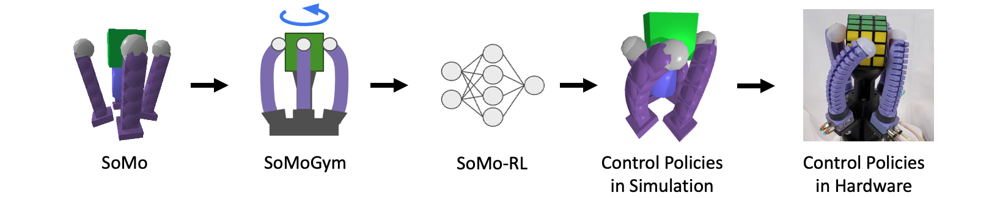
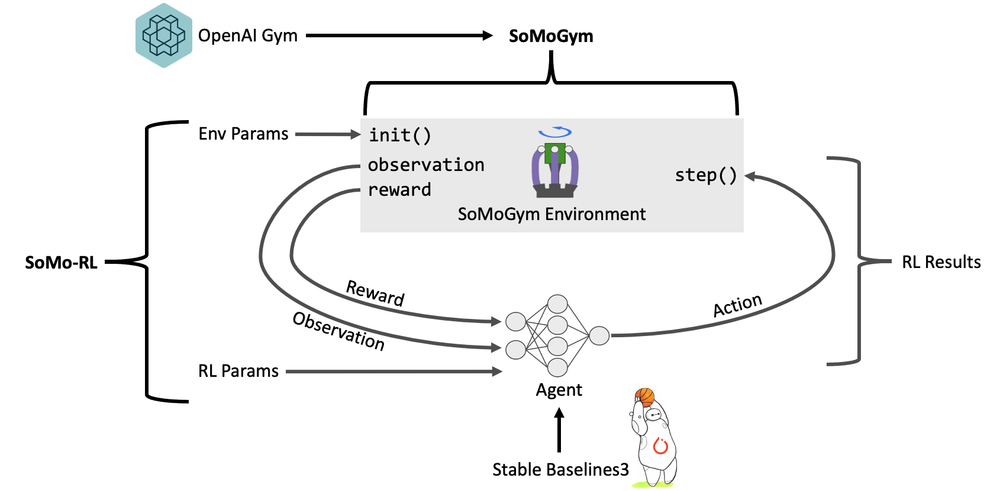
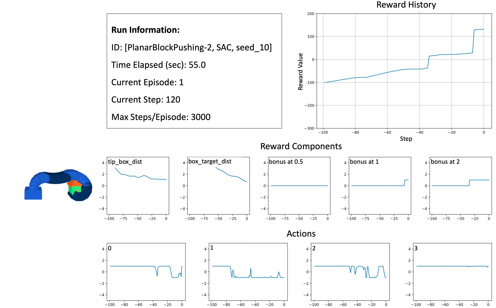
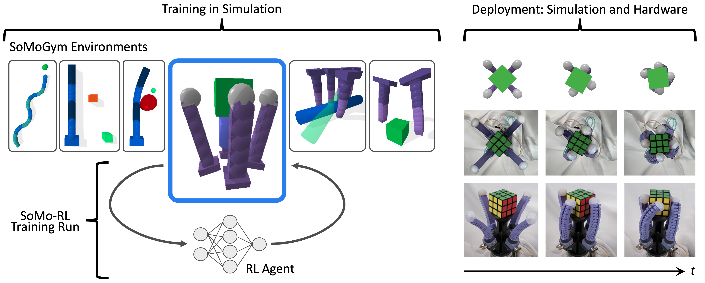

# somo-rl

> Reinforcement learning for continuum manipulators in SoMo / PyBullet

---
## README TODOs:
1. Instructions for configuring experiments directory
2. Postprocessing example code
---

SoMo-RL is an open-source toolkit for developing and evaluating control policies for soft robots. Using the SoMo simulation framework and SoMoGym library, SoMo-RL permits experiments on, e.g., the effects of varying control and robot design parameters, and enables the use of RL for such systems. SoMo-RL builds off the functionality of SoMoGym, providing a straightforward system for training RL policies on SoMoGym environments, managing experiments at scale, and analyzing RL results. In SoMo-RL, experiments are highly customizable, allowing for complete modification of learning hyperparameters and environment parameters through a single configuration file.



___

## Requirements
- Ubuntu 20.04
- Python 3.6+
> TODO: specify which versions of python work / dont work. i had problems with python 3.8 and/or 3.9 I think (because of pybullet)

- if python3.8 or 3.9 doesnt work: install python3.7; make sure to also install the venv for python3.7: apt-get install python3.7-dev python3.7-ven

## Setup
1. clone this repo: `git clone https://github.com/t7mccarthy/somo-rl.git`
2. upgrade pip: `python -m pip install --upgrade pip` or `pip install -U pip --upgrade`
3. create a dedicated virtual environment: `python -m venv /path_to_new_venv`
4. activate the environment: `source /path_to_new_venv/bin/activate`
5. from within your local repo, install the requirements: `pip install -r requirements.txt`

> If you want to run SoMo-RL on a research computing cluster, check out the `rc_cluster/` directory and additional documentation.

### Configuring Experiments Directory:

Throughout the framework, RL trials are divided into a three-layer hierarchy, which corresponds to the directory structure of experimental data and results. In order to run experiments, you need to have an experiments directory. When setting up this repo, make a new directory called something like `somo-rl_experiments/`. This will store experiments, run groups, and runs.

Each RL training run, where one training run learns one policy, is defined as a *run*. Each run is a member of a *run group*, which is further a member of an *experiment*. A single experiment is usually constructed to investigate a single point of comparison; run groups are usually distinguished along that point of comparison (e.g., varying RL algorithm), and runs are usually distinguished by random seed. In a run, the combination of experiment name, run group name, and run name is defined as the *run ID*.


## Unit Testing
SoMoGym uses pytest for testing, and it is helpful to run them after installing to ensure your codebase is configured correctly. In most cases, it will be better to ignore the tests that rely on the GUI -test coverage will be identical. You can run all tests with `$ pytest` from the repository's root and ignore the tests involving the GUI with `$ pytest -m "not gui"`. Run pytest from the repo root.


> Note: If you want to skip straight to technical codebase and usage details and skip the system overview, scroll down a lot until you get to Codebase Structure [TODO: link].
___

## Background



### Reinforcement Learning

At the most fundamental level, RL consists of an agent interacting with an environment and (potentially) receiving a reward in response to its action. The agent then learns from this reward response, with the goal of maximizing the total reward collected. The reward function, which defines the goal of a task, outputs a reward value according to the state's desirability. The agent generates a policy that maps its observed state to an action, which commands the control inputs of the environment to change. In deep RL setups, the agent is at least one neural network which is trained to maximize the resulting reward. Defining a policy *rollout* as the execution of a policy on an environment, we consider an RL agent successful when its trained policy consistently succeeds on rollouts.


### SoMo

SoMoGym and SoMo-RL use SoMo, a thin wrapper around PyBullet, which was designed for the simulation of soft/rigid hybrid systems. It facilitates the simulation of continuum manipulators by approximating them through rigid-link systems with spring-loaded joints and has been shown to accurately capture soft manipulator behavior. It is well-suited as the underlying engine for an RL benchmarking suite for soft/rigid hybrid tasks for two reasons: (i) its high-level interface enables the construction of varied environments that contain soft robots and other objects with complex contact interactions, and (ii) its rigid-link approximations make it fast---a crucial feature given the large amounts of data required in state-of-the-art RL algorithms.

Manipulators in SoMo are comprised of one or more actuators in series, which have either one or two bending axes commanded by torque control inputs. Input torques are applied to each discrete joint in the simulated actuator. In actuators with two actively controlled bending axes, applied joint torques alternate between controlled axes along the length of the actuator. Multiple manipulators can be present in a single SoMo environment, allowing for the possibility of hand-like systems and other complex manipulator assemblies. Rigid components (e.g., rigid palms and objects to manipulate) can also be added to SoMo environments to form soft/rigid hybrid systems. Furthermore, SoMo's accuracy and feature set let its simulation results transfer to physical systems with high fidelity, which ensures the utility of policies generated by SoMoGym and SoMo-RL when applied in the physical world.

### SoMoGym

SoMoGym provides a modular and straightforward way to define complex environments as control tasks for soft robots, allowing for easy evaluation of control policies and learning frameworks. It contains a set of predefined environments with pre-specified settings for use as a policy benchmarking suite. The gym, built in Python3, consists of environments that inherit from the environment (or `Env') class in OpenAI Gym. The format of OpenAI Gym environments is a standard for defining RL tasks, making SoMoGym's structure easy to understand within the RL community. During initialization, a SoMoGym environment defaults to its provided benchmark *run configuration*. To initialize a SoMoGym environment with custom settings, a run configuration dictionary can be provided with custom general simulation parameters (PyBullet time step, controller update rate, maximum torque for each actuator, etc.) and task-specific parameters (reward components and weights, observation components, object properties, etc.). SoMoGym also provides a variety of observation and reward functions, which can be selected, combined, or modified easily. Internally, SoMoGym relies on the SoMo framework to represent and control soft robots. As such, each continuum robot is described in a human-readable configuration file, making it easy to vary the number, positions, and properties of robots as well as other objects in each SoMoGym environment.

____

## SoMo-Gym Relevant Details


### Manipulator Control and Action Spaces

Actuators in SoMoGym are controlled via torque control, emulating
standard physical soft actuators. In SoMoGym, the action space usually
represents normalized absolute torque for each DOF of each actuator.
Each dimension of each environment’s action space can take on a value
from \(-1\) to \(1\), and we map from action values to actuator torques
using a *max\_torque\_multiplier* constant (provided in the run
configuration). The value of *max\_torque\_multiplier* can be specified
along with manipulator physical characteristics to reflect the dynamics
and capabilities of a physical system.

In controlling robots in SoMoGym manipulators, we consider two distinct
time step durations: action time and simulation time (defined in a run
configuration as *action\_time* and *bullet\_time*). Simulation time
represents how often the PyBullet simulation is updated; action time
represents how often a new policy input is applied and is the inverse of
the controller update rate. The simulation time has to be small enough
to avoid numerical instabilities; the magnitude of action time
determines the precision over time a policy can exhibit and depends on
the update rate of the real-world controller. However, as the physics
simulation of an environment runs faster with a larger simulation time,
maximizing simulation time has a big impact on the real-world time
required for training an RL policy (which especially matters in complex
environments). We found that a simulation time of 0.4 ms works well
across all of our examples, though this can be increased on a
case-by-case basis depending on environment complexity. Generally, more
complex environments require a smaller simulation time to maintain
numerical stability.

The action time should be small enough such that there is a high degree
of control over manipulator trajectories, but large enough to make each
action meaningful. As detailed in the following paragraph, instantaneous
jumps in applied torque are not supported in SoMoGym, so the
significance of each individual action on actuator trajectory decreases
as action time decreases. Additionally, increasing action time decreases
computational cost per unit of time in simulation. We found that an
action time of 10 ms provided sufficient granularity for each action
step across all of our environments.

Instantaneously applying a new actuator torque that is significantly
different from the current torque is (i) commonly not possible in
physical systems, and (ii) can lead to numerical instability in
simulated systems. In order to achieve stable and smooth motion as
actions are applied, we limit the change in torque per simulation step.
This also helps us achieve realistic system behavior; hardware systems
have actuation rate limits (e.g., caused by fluidic
resistance/capacitance in fluidic actuators). The torque rate limit is
defined in the run configuration field *max\_torque\_rate*. This creates
a gradual change in applied torque between simulation steps, ramping the
applied torque linearly according to *max\_torque\_rate* over an action
step until the commanded torque is achieved or the next torque command
is issued.

### Defining Observations, Reward, and Success

SoMoGym implements a set of state observation options, a set of reward
component options, and a success metric for each environment.
Observations are chosen based on what may be available on a hardware
system or useful in evaluating the impact of providing more complete
state information to an agent. Run configurations define which
observation options to use during training as the observation function.
This allows for easy comparison of the performance of different
observation spaces, helping us pursue useful questions like optimal
sensor placement. For continuum manipulators in our environments, we
commonly provide the following observation options:

1.  **Backbone positions:** position vectors of evenly spaced points
    along the center of a manipulator in the world coordinate frame. The
    maximum number of observable backbone positions is the number of
    links used to model the manipulator in SoMo. If \(n\) backbone
    positions are requested by a SoMoGym observation function (where
    \(n < \#\ links\)), the positions of evenly spaced links along the
    manipulator will be returned. If \(n=1\) backbone position is
    requested, the position of the most distal link will be returned.
    This could be collected in a physical system via \(n\) inertial
    measurement units (IMUs).

2.  **Link velocities:** velocity vectors of each link in the
    manipulator in the world coordinate frame. Like backbone positions,
    the maximum number of link velocities that can be observed is the
    number of links used to model the manipulator in SoMo. If \(n\) link
    velocities are requested by a SoMoGym observation function (where
    \(n < \#\ links\)), the positions of evenly spaced links along the
    manipulator will be returned. If \(n=1\) link velocity is requested,
    the velocity of the most distal link will be returned. This could be
    collected in a physical system via \(n\) IMUs.

3.  **Applied actuator torque inputs:** torques applied to the actuators
    of the manipulator. As the action space does not map directly to
    torque space, it is
    useful to observe the actual inputs applied to the system. In
    physical fluidic actuation systems, applied actuator torques is a
    known quantity.

If an external object is involved, we commonly provide the following
observation options:

1.  **Object position**: the position vector of the object in the world
    coordinate frame.

2.  **Object orientation**: the quaternion representation or Euler angle
    vector of the object’s orientation in the world coordinate frame.

3.  **Object velocity**: the velocity vector of the object in the world
    coordinate frame.

4.  **Manipulator distance vector**: the distance vector from the center
    of the object to the nearest point on the manipulator.

5.  **Tip distance vector**: the distance vector from the center of the
    object to the tip of the manipulator.

Similar to observations, the implementations of rewards and success
metrics are chosen based on availability of information, but are
entirely task dependent. Like observation functions, reward functions
are broken down into components selectable by run configurations. The
run configuration specifies the weight of each of these components in
the cumulative scalar reward during each action step. This structure
allows for the convenient comparison of different reward functions, and
makes it easy to evaluate the performance of policies along common axes
in the case that reward functions vary across an experiment. Success
metrics are binary representations of the performance of a policy
rollout, measured at the end of the rollout episode. A rollout is
considered successful if its final state is within a certain threshold
on some axes (e.g., an object is within 1 cm of a target position).


## SoMo-RL High-Level Overview

The SoMo-RL framework provides associated RL functionality to SoMoGym environments, enabling a simple way of running, tracking, and postprocessing RL experiments in SoMoGym environments with highly configurable settings. SoMo-RL uses implementations of RL algorithms from Stable Baselines3, a toolset that allows for easy use of popular RL algorithms. Given a run configuration file, SoMo-RL sets up experimental runs, instantiates SoMoGym environments, and executes training using Stable Baselines3. SoMo-RL further handles rollouts of trained policies, analysis of policy performance, and visualizations of training status over time.


### General Usage

SoMo-RL is divided into two main components: training and postprocessing. Experimental data and results are stored outside of SoMo-RL, though the path to a user's experiments directory is stored in the SoMo-RL user settings file. The training component includes functionality for training RL policies on SoMoGym benchmark environments and on custom environment settings. To start a training run, specify the experiment name, run group name, and run name, in addition to any optional parameters. Optional parameters include a flag to render the environment and an argument to display live-updating environment information in a configurable debugging GUI that can show observation space values, reward component values, applied torque values, and action values. On starting a training run, a run's *run directory* is set up with directories for *models*, *monitoring*, *results*, and *callbacks*. Depending on how RL settings are configured in the run configuration, data generated by a training run is stored in these directories as it is executed. As training runs often run over the course of days, a training run can be cancelled at any point in its duration and the training data and trained policy will remain available.



### Run Configurations

*Run Configurations* define SoMoGym environment settings and RL settings for training. 
Each pre-built environment has its own standard run configuration (saved as a .yaml
file), which defines the default setting of the environment. These
default settings are used in the SoMoGym benchmark. Environment related
settings vary from environment to environment, but
generally include:

  - **Action time:** time step over which a single action is applied to
    the system.

  - **Bullet time:** amount of time between updates to the PyBullet
    physics engine running the simulation.

  - **Environment id:** name and version of the SoMoGym environent to run.

  - **Torque multiplier:** value to multiply the normalized action space
    by in order to map from the action space to the torque space. This
    can be a scalar value or a vector depending on the torque limits of
    each actuator.

  - **Maximum torque rate:** maximum change in torque per simulation
    step.

  - **Observation flags:** list of which state components to include in
    the observation function. For observation components that are
    composed of more than one sample (e.g., positions along manipulator
    backbone), the number of samples is also specified. This number of
    samples corresponds to, for example, the number of a certain type of
    sensor placed along each manipulator.

  - **Reward flags:** list of which reward components to include in the
    reward function, along with the weight of each component.

We augment these run configurations when executing RL control policies. RL settings usually include:

  - **Random seed:** the seed used in all pseudorandom number generators
    across a run’s RL functionality and instantiated SoMoGym
    environment. As RL is sample inefficient and conducting a large
    number of trials in each experiment is computationally intensive, it
    is often only feasible to execute a particular setting on a few
    random seeds. As such, using the same set of random seeds across
    settings in a given experiment is important in understanding
    differences in performance.

  - **Algorithm:** RL algorithm to train with; all implementations from
    Stable Baselines\(3\) (A\(2\)C, DDPG, DQN, HER, PPO, SAC, TD\(3\))
    are supported by default, but any other algorithm that follows the
    Stable Baselines\(3\) model interface can be used easily.

  - **Policy:** RL policy network to train; the Stable Baselines\(3\)
    default policy networks for each algorithm are supported by default,
    but any policy network that follows the Stable Baselines\(3\) policy
    network interface and works with the selected RL algorithm can be
    used.

  - **Algorithm settings:** a dictionary holding optional
    hyperparameters to use as input during algorithm instantiation. This
    can include learning rate, entropy coefficient, buffer size, etc.

  - **Policy network settings:** a dictionary holding optional policy
    network hyperparameters. This can include network architecture and
    activation function.

  - **Training timesteps:** number of action steps to take during the
    training run, cumulative over all episodes.

  - **Maximum steps per episode:** maximum number of action steps per
    episode. If stopping conditions are in place for the particular
    environment, an episode can be shorter than this value.

  - **Callback settings:** parameters defining how often to save and
    evaluate the policy during training.


___

## Codebase Structure

The SoMo-RL repo contains all scripts for training and analyzing policies. The SomoGym repo contains the gym environment for running each task, as well as benchmark settings for each.

> Note: A *run* is defined as a single training trial to develop a single policy. A *run group* is defined as a related collection of runs. An *experiment* is defined as a collection of run groups. This distinction is important to the structure of the somo-baseline-results repo, and to the running of scripts within this repo. 

### Main Scripts

Users interact with two main scripts to train RL policies:
1. `train_policy.py`: executes a training run based on a given run config. First, directories to save run data are created in the run's directory. A SomoGym environment is instantiated according to the run's config, and a Stable Baselines training run is established. Logging occurs throughout training, and callback models are save periodically according to the run config.

2. `train_benchmark_policy.py`: executes a trainig run using benchmark config parameters for the SoMoGymym environment. RL paramters are still specified in a provided run config.

3. `postprocessing/process_experiment_reward.py`: handles postprocessing of policies and training run performance. It calls functions defined in the `postprocessing/utils/` directory, which contain functionality to plot reward curves, test out policies, and visualize policy performance. The file currently does not have well defined options, so see the Basic Usage section below for some sample script lines.

The `postprocessing/` directory contains three modules for evaluating training and policy performance:
1. `run_policy.py`: runs a trained policy on an environment, recording performance and state data at each step. There are a lot of command line args for running this as a script.
2. `process_run_reward.py`: parses the monitoring output of a given run, loading the data into a pandas dataframe. There is also basic plotting functionality.
3. `process_experiment_reward.py`: processes the monitoring output of all runs in an experiment, or of a selected set of runs in an experment. This data is compiled into a pandas dataframe, and used in comparison plots.


## Basic Usage

### Setting up a Training Run

To set up a training run, you need to create a run folder in the experiments directory and write a run config file.

1. In your experiments directory, make a new directory for a new experiment. Here, we'll refer to that new directory as `test_exp/`.
2. In `text_exp/`, make a new directory for a new run group. We'll refer to this as `setup_0/`.

3. In `text_ep/setup_0/`. make a new directory for a new run, which we'll refer to as `random_seed_0/`.

4. Make a new file in `text_ep/setup_0/random_seed_0/` called `run_config.yaml`. This is your run config file.

5. Enter your desired settings into the run config. It probably will look something like this:

```.yaml
action_time: 0.01
alg: PPO
bullet_time_step: 0.0002
checkpoint_cb:
  save_freq: 10000
env_id: InHandManipulation-v0
eval_cb:
  eval_freq: 50000
  n_eval_episodes: 1
failure_penalty_multiplier: 100
max_episode_steps: 1000
max_torque_rate: 130
num_threads: 4
observation_flags:
  box_or: null
  box_pos: null
  torques: null
policy: PPOMlpPolicy
reward_flags:
  position: -5
  z_rotation: 10
seed: 0
torque_multiplier: 65
training_timesteps: 10000000
```

Now your new training run is set up!

### Executing a Training Run

Note: currently, the SoMo-RL repo and SomoGym repo must be located in the same directory on your machine.

1. Make a file `user_settings.py` in the base directory of this repo. Define the absolute path to your experiments directory as `EXPERIMENT_ABS_PATH`.
2. Prepare a run (and a run config) in your experiments directory (the same one your `EXPERIMENT_ABS_PATH` goes to).
3. There are several command line arguments used in actually executing a run:
    - `exp_name` (`-e`): required, name of experiment in your experiments directory.
    - `run_group_name` (`-g`): required, name of run group within experiment.
    - `run_name` (`-r`): required, name of run within run group.
    - `render` (`-v`): optional, if present, show pybullet rendering while running training. This should only be used for debugging as it will slow down training significantly.
    - `debug` (`-d`): optional, if present, show debugging dashboard with all debugger components.
    - `debug_list` (`-dl`): optional, list (space separated) of debugger components to show (choose from reward_components, observations, actions, applied_torques). If present, show debugging dashboard with only these selected debugger components.
    - `overwrite` (`-o`): optional, allow overwrite of old data if the training run has prevously been started.
    - `note`: optional, notes on training run.
4. To run, simply execute `train_policy.py` or `train_benchmark_policy.py` followed by command line arguments in the terminal. Most runs will look something like:

    ```
    (venv) somo-rl tom$ python train_policy.py -e test_experiment -g test_group -r test_run
    ```
    or for debugging, something like:
    ```
    (venv) somo-rl tom$ python train_policy.py -e test_experiment -g test_group -r test_run -v -dl reward_components observations -o
    ```

Again, the difference between `train_policy.py` and `train_benchmark_policy.py` is that `train_benchmark_policy.py` will overwrite environment settings in your run_config with those found in the `benchmark_run_config.yaml` file in the SomoGym environment directory.

### Running a trained policy: TODO

After you've started training and have the final policy file (or a callback policy file), you can easily run a rollout of it in simulation to get a sense of its performance. This is done with `run_policy.py`, which has a number of command line args.

### Postprocessing training data: TODO :disappointed:

Run `process_run_reward.py` or `process_experiment_reward.py`



___
Copyright 2022 Thomas P. McCarthy and Moritz A. Graule, Harvard John A. Paulsen School of Engineering and Applied Sciences. All Rights Reserved.